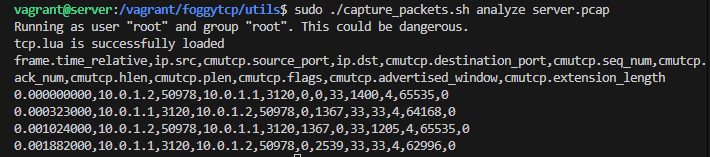
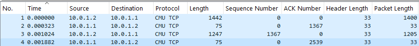

# Introduction
In this checkpoint, you need to implement a basic TCP with:

* Sequence number and acknowledgement number, and
* Sliding window.

The starter code is provided for you which is a stop-and-wait plementation built on UDP. You need to implement the seq/ack numbering and sliding window based on it.

# Starter code

### ```server.cc``` and ```client.cc```
The two sample applications for server and client. 

### ```foggy_tcp.cc```
The API exposed to application is defined in this file. There are four core functions whose signatures should not be changed :```foggy_socket()```, ```foggy_close()```, ```foggy_read()```, and ```foggy_write()```. An application requests a new foggy-TCP socket by calling the foggy_socket function. The socket created in ```foggy_socket()``` is actuall a UDP socket and our job is to enhance it to TCP.

### ```foggy_backend.cc```
This file implements foggy-TCP’s core logic which runs in a separate backend thread. This is important as TCP must
be able to work independently from the application (i.e., receiving, acknowledging and retransmitting packets). 

### ```foggy_function.cc```
This file implements foggy-TCP's function logics. Most of your implementations may be here.

### ```foggy_packet.cc```
This file implements helper functions to create and manipulate packets. Please do not modify this file.

# Run the starter code
In this checkpoint and the following you need to use your own TCP (foggy-tcp) instead of system TCP. So use the following command to build foggy-tcp.
```bash
make foggy
```

In the server VM, at the `/vagrant/foggytcp` folder, run the server with the following command:
```bash
./server 10.0.1.1 3120 test.out
```

In the client VM, at the `/vagrant/foggytcp` folder, run the client with the following command:
```bash
./client 10.0.1.1 3120 src/client.cc
```

Now you have successfully transmitted the `client.cc` file from the client to the server, named as `test.out`.

# How to debug
A bash script ```capture_packets.sh``` is provided for you to capture and analyze network packets.

## Packet capture
Converting file capture_packets.sh to Unix format.
```bash
sudo apt-get install dos2unix
dos2unix capture_packets.sh
```

Start packet capture.
```bash
sudo ./capture_packets.sh start <name>.pacp
```

Stop packet capture
```bash
sudo ./capture_packets.sh stop <name>.pcap
```

## Packet analyse

### Packet analyse using the bash script
```bash
sudo apt-get install tshark
sudo ./capture_packets.sh analyze <name>.pcap
```
Then you should see something like this:



### Packet analyse using Wireshark
Wireshark is a powerful network packet capture and analysis tool. [Download here.](https://www.wireshark.org/download.html) After installation, copy the lua file ```tcp.lua``` to the directory for wireshark plugins, for example: ```E:\Applications\Wireshark\plugins```. Then start wireshark and open the captured file ```<name>.pacp```. Now you can analyze the packets with a beautiful user interface.
