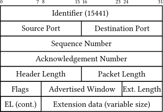
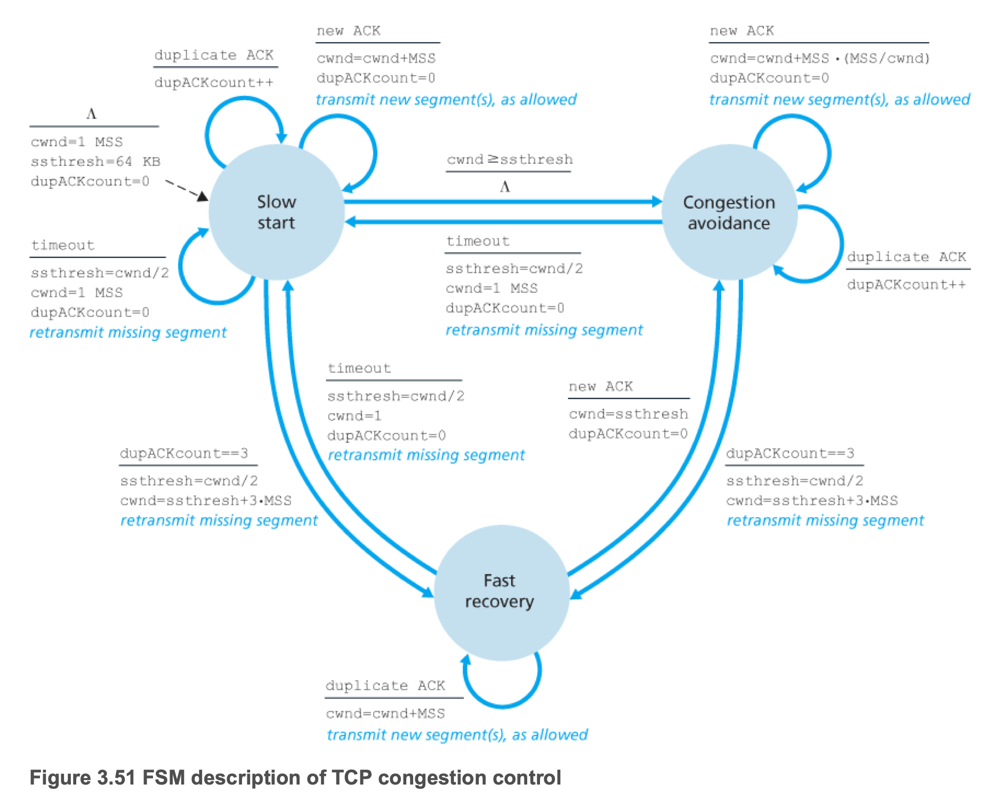

# Introduction
In this checkpoint, you need to implement TCP Reno, as discussed in class, based on **your own TCP** in CP2. What you need to implement in CP3 includes:

* Loss recovery,
* Flow control, and
* Congestion control.

In general, the number of outstanding (unACKed) bytes is equal to min(RWND, CWND). RWND is the advertised window size of receiver and CWND is the congestion window size of sender. RWND is determined by the receiver according to buffer size, CPU processing ability and system memory size. TCP Reno can adjust CWND to avoid network congestion according to the network condition.

# Loss recovery
When the packet loss happens, you should be able to detect the packet loss and recover it. The sender detects the packet loss by timeout (**to simplify, we don't need to consider timeout in our project**) and three duplicate ACKs. Then the sender should retransmit the lost packet again to recover the loss.

# Flow control
Flow control is related to RWND and we can get the value from the header of ACK packets from the receiver. The advertised window in the packet header is equal to RWND as shown in the following figure. RWND is related to the remaining buffer size at the receiver to avoid buffer overflow. For example, if the buffer size of the receiver is 64 MSS bytes and there are 30 MSS bytes in the buffer, the advertised window size is 34 MSS bytes now (**to simplify, we don't need to consider this in CP3**). **What you need to do in flow control is for the sender to be able to adjust the sending window size according to RWND when RWND has been changed**. So the sender needs to extract the advertise window size from the header and adjusts the sending window size according to the formulation min(RWND, CWND).



And in the code, we use
```
window.advertised_window
```
to represent the advertise window size and provide
```
get_advertised_window/set_advertised_window
```
to get/set the advertised window size in the packet header.
# Congestion Control
Congestion control is related to CWND, which we can get the value in the sender. And in the code, we use
```
windows.congestion_window
```
to represent the congestion window size.

Congestion control is composed of three different parts: slow start, congestion avoidance and fast recovery. Then we introduce the detail of them.

Slow start: at the beginning, CWND is 1 MSS and every time the sender receives a ACK, CWND increases by 1 MSS. So CWND will be doubled every RTT time.

Congestion avoidance: During the slow start process, CWND is not doubled all time. After CWND reaches the threshold value-SSTHRESH (MSS * 64 by default), CWND only increases (MSS/CWND) MSS, which is equal to 1 MSS every RTT time. This process is called congestion avoidance.

Fast recovery: By default, the sender have to go back to slow start state when the sender detects three duplicate ACK or timeout (**to simplify, we don't need to consider timeout in our project**). But now, we have fast recovery, which means the sender only needs to set SSTHRESH=SSTHRESH/2 and CWND=SSTHRESH+3*MSS.


So what you have to do is to implement this FSM. And you have to update the sending window size according to min(CWND, RWND) all the time. For this FSM, we already have provided some variables in the code.

FSM state 
```
window.reno_state
```
```
typedef enum {
  RENO_SLOW_START = 0,
  RENO_CONGESTION_AVOIDANCE = 1,
  RENO_FAST_RECOVERY = 2,
} reno_state_t;
```

SSTHRESH
```
window.ssthresh
```
```
WINDOW_INITIAL_SSTHRESH
```

# What to submit
Your implementation should be in the following files: ```foggy_function.cc```, ```foggy_tcp.cc```, ```foggy_function.h``` and ```foggy_tcp.h```. You can run the `submit.py` at the root of the project which will generate a `submit.zip` file including these four files, then submit the `submit.zip` file to Gradescope. The autograder will copy those four files you submitted to the starter codes and do the testing.

You also have to include your CP2 implementation in CP3 because CP3 is based on your CP2 code.
